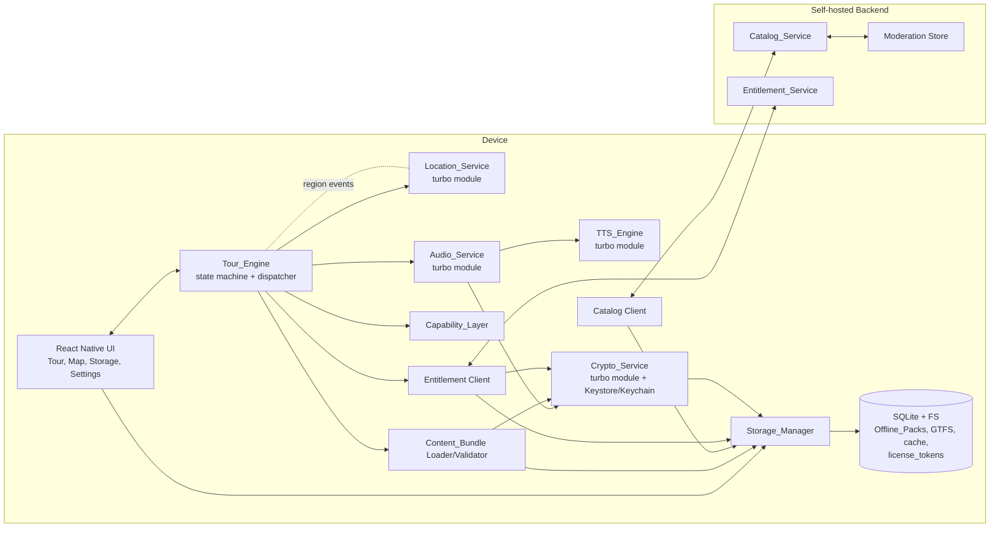
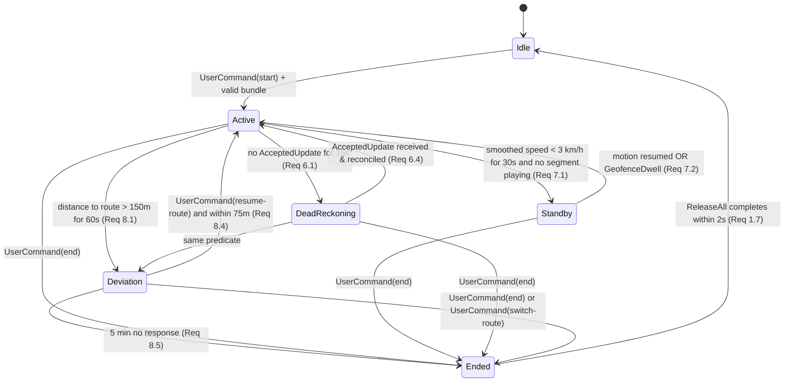

# Design Document

## Overview

Tramio is a React Native (TypeScript) application that turns regular city transit rides into geofenced audio tours. The design is organized around an offline-first runtime: a deterministic Tour_Engine consumes filtered location updates and dispatches narrative segments authored as JSON + Markdown bundles. Native turbo modules wrap CoreLocation + FusedLocationProviderClient/GeofencingClient (location), AVSpeechSynthesizer + Android TextToSpeech (TTS), and AVFoundation + ExoPlayer (audio). A capability layer detects OS surfaces and lets the engine opt into newer APIs without forking. A small self-hosted backend (Catalog_Service, Entitlement_Service) carries bundle metadata and entitlement decisions; receipts and Device_Id are the only identity primitives.

The MVP targets a single city with one to two routes. The same primitives are required to support freemium gates, time passes, token unlocks, and B2B micro-narratives without rework, so entitlement-aware filtering is built into the engine, not bolted on later.

### React Native flavor

We use **Expo bare** (prebuilt native projects) rather than vanilla React Native. The application requires:

- Custom turbo modules wrapping native iOS/Android APIs (location/audio/TTS).
- Background audio + region monitoring background modes.
- Foreground services on Android.
- MapLibre GL Native at the view layer.

Expo's managed runtime cannot host these without ejecting; Expo bare gives us config plugins and EAS Build while keeping full native control. Any surface that needs `react-native config` or unmodified Android `Application`/iOS `AppDelegate` access remains available.

## Architecture

### Component diagram



### Layering rules

- The **Tour_Engine** is a pure, side-effect-free reducer over an explicit state object. It receives events (`LocationAccepted`, `LocationRejected`, `Timer`, `EntitlementChanged`, `UserCommand`, `AudioFinished`, `FocusLoss`, `FocusRegain`) and emits commands (`PlaySegment`, `StopAudio`, `RequestLocationPriority`, `ScheduleTimer`, `ShowDeviationPrompt`). This is what we property-test.
- **Location_Service**, **Audio_Service**, **TTS_Engine** translate engine commands into native calls and forward native events back as engine events.
- **Crypto_Service** is a turbo module (TS surface + thin native bridge to iOS Keychain / Android Keystore). It owns hardware-backed secret access, Wrapping_Key derivation, per-pack Content_Key wrapping/unwrapping, License_Token verification, and a streaming AEAD decrypt API. The Tour_Engine never touches Crypto_Service directly: Audio_Service requests decrypted streams, and the Bundle Loader requests narrative plaintext on demand.
- The **Capability_Layer** sits behind a `useCapabilities()` hook so the engine reasons about feature flags, not about OS versions directly.
- **Storage_Manager** owns the filesystem and SQLite. Bundle loader, catalog client, and entitlement cache go through it.
- **Catalog_Client / Entitlement_Client** never block tour playback; they read from cache during a tour.

### Process / thread model

- iOS: main RN thread for UI; CoreLocation delegate runs on main; audio session on AVAudioSession; background audio mode + region monitoring keep the app alive.
- Android: foreground service hosts ExoPlayer and a `LocationCallback`; GeofencingClient delivers PendingIntents that bring the engine forward via headless JS task when needed.

## Components and Interfaces

### Branding module

Single source of truth for every public-brand string and every domain/identifier the app uses to reach its backend. Lives at `packages/branding/`. Consumed by UI, Catalog_Client, Entitlement_Client, and the platform-config generators (Expo `app.config.ts`, iOS `Info.plist` template, Android `build.gradle` `applicationId`).

Static configuration (TypeScript, exported as a frozen object):

```ts
export interface BrandConfig {
  readonly displayName: 'Tramio';
  readonly primaryDomain: 'tramio.app';
  readonly supportUrl: string; // e.g. 'https://tramio.app/support'
  readonly deepLinkScheme: 'tramio';
  readonly bundleIdProd: 'app.tramio.client';
  readonly bundleIdDev: 'app.tramio.client.dev';
}

export const BRAND: BrandConfig = Object.freeze({
  displayName: 'Tramio',
  primaryDomain: 'tramio.app',
  supportUrl: 'https://tramio.app/support',
  deepLinkScheme: 'tramio',
  bundleIdProd: 'app.tramio.client',
  bundleIdDev: 'app.tramio.client.dev',
});
```

Runtime configuration (separate layer, not part of `BrandConfig`) reads `CATALOG_BASE_URL` and `ENTITLEMENT_BASE_URL` from environment-based config (`.env.{profile}` consumed by EAS Build and surfaced via `expo-constants`). This lets the primary domain be swapped at deploy time without rebuilding non-config source code (Req 24.4). The Catalog_Client and Entitlement_Client read these resolved URLs at construction time; nothing in the codebase hard-codes `https://tramio.app/...`.

### Tour_Engine

Owns the active tour session and the state machine described in `## State Machine`. Pure reducer plus an effect runtime. Inputs are time-stamped; outputs are idempotent commands. The engine never speaks to the network, never reads the filesystem; it asks Storage_Manager and Entitlement_Client through commands.

Key responsibilities:

- Geofence pipeline orchestration (delegates per-stage logic to Location_Service for low-level filters and to its own evaluator for dwell and direction).
- Single-segment invariant (`|playing| <= 1`).
- Consumed-set tracking per session.
- Standby_Track scheduling.
- Deviation detection.
- Dead_Reckoning entry, advance, reconcile.
- Entitlement-aware segment selection, including B2B disclosure pre-roll.
- Capability flag consumption.
- Decryption-aware segment dispatch: instead of asking Audio_Service to load a path directly, the engine emits `RequestDecryptedSegment(segmentId)`. Audio_Service resolves the segment to its `.enc` asset on disk, asks Crypto_Service for a streaming decrypt handle, and pipes that into AVAudioPlayer / ExoPlayer. The engine never sees plaintext bytes.

### Location_Service (native turbo module)

Wraps:

- iOS: `CLLocationManager` (region monitoring, significant location changes, foreground high-accuracy windows).
- Android: `FusedLocationProviderClient` (priority-controlled updates) + `GeofencingClient` (geofence dwell events) + foreground service.

Exposes:

- `setMode(mode: 'idle'|'standby'|'tour-bg'|'tour-approach'|'reconcile')`
- `armGeofences(geofences: Geofence[])`
- `disarmAll()`
- Events: `onAccepted(update)`, `onRejected(reason, update)`, `onGeofenceEnter(id)`, `onGeofenceDwell(id)`, `onGeofenceExit(id)`, `onAccuracyChanged`.

Filtering pipeline (described under `## Geofence Filtering Pipeline`) lives partly in native (accuracy gate, spike rejection) and partly in JS (smoothing, dwell, direction). Native is preferred when it preserves battery; we keep dwell/direction in JS so they are property-testable.

### Audio_Service (native turbo module)

Wraps `AVAudioPlayer`/`AVAudioSession` on iOS and `ExoPlayer` + `AudioFocusRequest` on Android. Responsibilities:

- Sequential playback of one segment at a time.
- Volume normalization across pre-rendered audio and TTS output (target loudness ~ -16 LUFS, ±3 dB).
- Audio focus loss / regain handling with offset capture.
- Ducking on transient events.
- Plaintext-free playback path: on `RequestDecryptedSegment`, Audio_Service opens a streaming decrypt handle from Crypto_Service and feeds the player a chunked input stream (`AVAssetResourceLoaderDelegate` on iOS, custom `DataSource` on Android). Plaintext bytes never touch the filesystem and never leave the native module's address space.

### TTS_Engine (native turbo module)

Wraps `AVSpeechSynthesizer` (iOS) and `android.speech.tts.TextToSpeech` (Android). Resolves voice by `(language, region)` with documented fallback chain. Emits the same playback events as Audio_Service so the engine treats them uniformly.

### Crypto_Service (TypeScript module + native turbo module)

Owns all cryptographic state for the at-rest protection scheme described in Requirements 21–23. Composed of a TypeScript front-end (orchestration, License_Token parsing, HKDF, AEAD framing) and a thin native bridge that does only what must be native: Keychain/Keystore I/O.

Responsibilities:

- **Hardware-backed secret management**. On first launch (or after Keystore wipe), generate a 32-byte random `hardware_secret` and store it:
  - **iOS**: in Keychain with `kSecAttrAccessibleAfterFirstUnlockThisDeviceOnly`. When `caps.secureEnclaveAvailable` is true, the Keychain item is bound to a Secure Enclave-resident key (`kSecAttrTokenIDSecureEnclave`) and the symmetric secret is wrapped under that key.
  - **Android**: in the AndroidKeystore. When `caps.strongBoxAvailable` is true, the key generation uses `setIsStrongBoxBacked(true)`. Keys are non-exportable and require user authentication only at the device-unlock level (no per-use biometric prompt for the MVP, since playback must work offline in transit).
- **Wrapping_Key derivation**. `Wrapping_Key = HKDF-SHA256(ikm = hardware_secret, salt = Device_Id, info = "tramio/v1/wrap", length = 32)`. The info string is versioned (`/v1/`) so future key-derivation changes can coexist with existing wrapped keys. The `info` string is split across multiple compilation units and reassembled at runtime as a defense-in-depth obfuscation against `strings(1)` greps (Req 21.8). This is not security; it is friction.
- **AEAD primitive**. AES-256-GCM. Chosen over XChaCha20-Poly1305 because both iOS (CryptoKit / CommonCrypto) and Android (Conscrypt with AES-NI on ARMv8 Crypto Extensions) have hardware-accelerated AES paths and the throughput is comparable; AES-GCM gives us parity. 12-byte nonce per asset, prefixed to ciphertext. 16-byte auth tag, suffixed.
- **Per-pack Content_Key wrapping**. The catalog never sees the device's Content_Key. At pack-build time the catalog generates `Content_Key` and wraps it under the device's License_Token-bound permission (see License_Token below) so the per-device unwrap step is what actually authorizes decryption.
- **Streaming decrypt API**. AES-GCM's "all-or-nothing" auth tag is incompatible with true streaming, so we frame each protected asset into 64 KiB chunks, each with its own nonce + tag, and a per-chunk sequence number bound into the AAD to prevent reordering. The decrypt API exposes `openStream(assetPath, contentKey) -> ReadableStream<Uint8Array>` to native code only; the JS bridge sees a handle, not bytes.
- **License_Token verification**. Verifies the JWS signature against the embedded Ed25519 public key (with `kid` lookup and pinned fallback set), and exposes the unwrapped `wrappedContentKey` to the caller only after the token is structurally valid, signature-verified, unexpired, and bound to `(deviceId, bundleId, bundleVersion)`.

Public TS surface (sketch):

```ts
interface CryptoService {
  // Bootstrap; idempotent.
  ensureHardwareSecret(): Promise<void>;
  // Pure once hardware_secret is provisioned.
  deriveWrappingKey(deviceId: string): Promise<KeyHandle>;
  // Verifies + unwraps Content_Key. Throws on signature/expiry/binding failure.
  unwrapContentKey(
    pack: { bundleId: string; version: string },
    license: LicenseToken,
    wrappingKey: KeyHandle,
  ): Promise<KeyHandle>;
  // Streaming decrypt; the returned handle is consumed in native code.
  openDecryptedStream(encAssetPath: string, contentKey: KeyHandle): Promise<DecryptStreamHandle>;
  // For the bundle loader (small narrative markdown files).
  decryptInMemory(encAssetPath: string, contentKey: KeyHandle): Promise<Uint8Array>;
}
```

`KeyHandle` is opaque to JS. Native code resolves it to raw key material only inside the AEAD primitive call.

### License_Token format and lifecycle

**Format**: JWS compact serialization, signed with **Ed25519** by the Entitlement_Service. Header carries `alg: "EdDSA"` and `kid` for key rotation. Payload claims:

```json
{
  "deviceId": "anon-device-...",
  "bundleId": "wroclaw-tram-7-east",
  "bundleVersion": "1.4.2",
  "iat": 1735689600,
  "exp": 1736899200,
  "wrappedContentKey": "base64(...)",
  "kid": "ent-2025-01"
}
```

- `exp - iat >= 14 * 24 * 3600` (Req 22.4). Default issuance window is 21 days.
- `wrappedContentKey` is the per-pack Content_Key wrapped to the device's identity. Concretely: a small KEM step (X25519 ECIES) where the device's long-lived static public key is registered with the Entitlement_Service at first-launch, and the catalog wraps `Content_Key` for that pubkey. Local unwrap requires the device's hardware-bound private key (held in Keychain/Keystore alongside `hardware_secret`).
- The verification public-key set is embedded in the app binary. `kid` resolves to one of a small pinned set (current + `n` retired). Rotation policy: a new `kid` is added in a non-breaking app release, an issued key is rotated only after the prior `kid` has been distributed to all supported app versions, retired keys remain in the pinned set for ≥ 1 release.

**Storage**: SQLite table `license_tokens(bundle_id TEXT, bundle_version TEXT, jws BLOB, exp_utc INTEGER, fetched_at_utc INTEGER, PRIMARY KEY (bundle_id, bundle_version))`.

**Refresh lifecycle**:

1. On every app foreground with an unmetered connection, scan `license_tokens` for rows where `exp - now <= 3 days` (Req 22.5).
2. For each such row, call `POST /v1/license/refresh` with `(deviceId, bundleId, bundleVersion, currentJws)`. Server returns a new JWS.
3. Crypto_Service verifies the new JWS against the embedded public-key set; on success, the row is replaced atomically.
4. On signature failure the new token is discarded and the existing token is kept until expiry; the failure is logged as a security telemetry event.
5. Refresh is best-effort and never blocks tour start. A pack with an unexpired token plays fully offline.

### Content_Bundle loader/validator

Pure TypeScript (Node-compatible) module. Validates a bundle directory against the `Authoring_Schema` (JSON Schema 2020-12) and a small set of cross-file invariants (e.g., every POI's narrative reference resolves to a real markdown file in a declared language). Returns either a typed `LoadedBundle` or a structured `BundleValidationError` with file path + JSON pointer + offending field. This module is the schema's single source of truth at runtime.

### Catalog client

Thin REST client over `Catalog_Service`. Used outside of active tours. Honors the unmetered/metered policy: it may probe for new versions on any connection, but downloads only on unmetered unless the user opts in.

### Entitlement client

Resolves `Device_Id -> EntitlementSet`. Caches with declared expiry. During a tour, reads from cache only. Validates platform store receipts via Entitlement_Service.

### Capability_Layer

Static descriptor table per OS version + a runtime probe for each capability. Exposes flags such as:

- `regionMonitoringV2`
- `liveActivities`
- `foregroundServicePartialWakelock`
- `isolatedAudioFocus`
- `dynamicTypeXL`
- `secureEnclaveAvailable` (iOS: Secure Enclave available and usable for the Keychain item class we want)
- `strongBoxAvailable` (Android: `PackageManager.FEATURE_STRONGBOX_KEYSTORE`)
- `aesNiAccel` (CPU has AES hardware acceleration; informational, used to size chunk boundaries)

When `secureEnclaveAvailable` and `strongBoxAvailable` are both false, Crypto_Service falls back to a software-only KDF + AES-GCM path. The hardware-backed secret is still stored in Keychain / AndroidKeystore (just not in a secure element). This is weaker than the secure-element path but still better than plaintext on disk and still defeats the casual `cp -R` attack against a different device, since the Keychain/Keystore items are not exported by standard backup tools.

The Tour_Engine's command translators read flags rather than OS versions, so newer paths can be enabled without reshaping the engine.

### Storage_Manager

Owns:

- Offline_Pack store under `${docs}/packs/{bundleId}/{version}/`.
- GTFS feeds under `${support}/gtfs/{cityId}/{feedVersion}/`.
- SQLite for: pack manifests, asset checksums, Device_Id, entitlement cache, LRU access timestamps, catalog moderation snapshot, License_Token cache (`license_tokens`).
- Atomic writes via stage + rename.

### Identity boundaries

This subsection consolidates which string lives where, so future readers can audit any single identifier against its layer at a glance.

| Layer                                                                                              | Strings                                                                 | Where they live                                                                                                                                                                                          |
| -------------------------------------------------------------------------------------------------- | ----------------------------------------------------------------------- | -------------------------------------------------------------------------------------------------------------------------------------------------------------------------------------------------------- |
| Brand surfaces (UI, About screen, store metadata, attribution, launcher, crypto info, schema URIs) | `Tramio` / `tramio`                                                     | `packages/branding/` (single source of truth) and the explicitly listed UI surfaces; crypto info string in `packages/crypto-service/`; schema base in `packages/authoring/`                              |
| Bundle ID / domain (config, swappable)                                                             | `app.tramio.client` (prod), `app.tramio.client.dev` (dev), `tramio.app` | Platform manifests (iOS `CFBundleIdentifier`, Android `applicationId`) generated from `packages/branding/`; `CATALOG_BASE_URL` and `ENTITLEMENT_BASE_URL` resolved from environment-based runtime config |

## Data Models

### Authoring_Schema

A Content_Bundle is a directory. The **authoring** layout uses plaintext narrative and audio files; the **on-device pack** layout (Offline_Pack) replaces protected assets with their `.enc` ciphertext counterparts and adds an Integrity_Signature file.

Authoring layout (what content authors produce, what the catalog ingests):

```
bundles/
  {bundleId}/
    manifest.json
    route.json
    pois.json
    narratives/
      {poiId}.{lang}.md
    audio/                 # optional pre-rendered
      {poiId}.{lang}.m4a
    standby/
      {trackId}.json
      {trackId}.{lang}.md
      {trackId}.{lang}.m4a # optional
    tiles/
      {z}/{x}/{y}.pbf
```

On-device Offline_Pack layout under `${docs}/packs/{bundleId}/{version}/`:

```
packs/{bundleId}/{version}/
  MANIFEST.lock.json         # signed payload (per-asset hashes, encryption metadata)
  MANIFEST.lock.sig          # detached Ed25519 signature over MANIFEST.lock.json
  manifest.json              # plaintext (public metadata, schema validation input)
  route.json                 # plaintext (public, no narrative content)
  pois.json                  # plaintext (geometry + asset references; tier flags here are not secret)
  narratives/
    {poiId}.{lang}.md.enc    # AES-256-GCM, framed in 64 KiB chunks
  audio/
    {poiId}.{lang}.m4a.enc   # AES-256-GCM, framed in 64 KiB chunks
  standby/
    {trackId}.json
    {trackId}.{lang}.md.enc
    {trackId}.{lang}.m4a.enc
  tiles/
    {z}/{x}/{y}.pbf          # NOT encrypted (Req 21.2)
```

The pack-builder pipeline (run by the catalog at publish time) is:

1. Validate authoring bundle.
2. Generate per-pack `Content_Key` (32 random bytes).
3. For each protected asset, framed-AES-GCM-encrypt to `{path}.enc` and record the SHA-256 of the ciphertext.
4. Compute SHA-256 of all unprotected files as-is.
5. Build `MANIFEST.lock.json` (described below) and sign it.

#### manifest.json

```json
{
  "$schema": "https://schema.tramio.app/manifest/1.json",
  "bundleId": "wroclaw-tram-7-east",
  "version": "1.4.2",
  "city": { "id": "wroclaw", "country": "PL" },
  "transitLine": {
    "gtfsRouteId": "7",
    "direction": "east",
    "agency": "MPK"
  },
  "languages": ["pl", "en", "de"],
  "defaultLanguage": "pl",
  "minAppVersion": "1.0.0",
  "deadReckoning": { "permitted": true, "maxLeadSeconds": 30 },
  "standbyTracks": ["trivia-architecture", "trivia-history"],
  "attribution": [
    { "kind": "osm" },
    { "kind": "cc", "license": "CC-BY-4.0", "attribution": "Wikipedia: ..." }
  ],
  "checksumAlgorithm": "sha256"
}
```

Schema URIs are versioned (`/manifest/1.json`) so future schema changes can coexist with published bundles.

#### route.json

```json
{
  "bundleId": "wroclaw-tram-7-east",
  "polyline": [[51.11, 17.03], [51.111, 17.032], "..."],
  "stops": [
    { "id": "stop-001", "gtfsStopId": "1234", "coord": [51.11, 17.03], "scheduledOffsetSec": 0 },
    { "id": "stop-002", "gtfsStopId": "1235", "coord": [51.114, 17.041], "scheduledOffsetSec": 180 }
  ],
  "deviationCorridorMeters": 150
}
```

#### pois.json

```json
{
  "pois": [
    {
      "id": "poi-rynek",
      "category": "landmark",
      "priority": 90,
      "geometry": { "kind": "circle", "center": [51.11, 17.031], "radiusMeters": 60 },
      "directionFilter": { "kind": "alongRoute", "tolerance": 30 },
      "dwellSec": 3,
      "deferrable": true,
      "drPermitted": true,
      "tier": "free",
      "narratives": {
        "pl": "narratives/poi-rynek.pl.md",
        "en": "narratives/poi-rynek.en.md"
      },
      "audio": {
        "en": "audio/poi-rynek.en.m4a"
      },
      "deeperLayers": [
        {
          "id": "poi-rynek-deep-1",
          "tier": "token_unlock",
          "narrative": "narratives/poi-rynek-deep-1.pl.md"
        }
      ]
    }
  ]
}
```

#### Narrative Markdown frontmatter

```markdown
---
poiId: poi-rynek
language: pl
durationHintSec: 45
sponsor: null
disclosure: null
licenses:
  - id: CC-BY-4.0
    attribution: 'Photo and text adapted from Wikipedia'
---

# Rynek

Plac otoczony XIII-wiecznymi kamienicami...
```

For a B2B segment:

```markdown
---
poiId: poi-cafe-zamek
language: en
sponsor: cafe-zamek
disclosure: 'Sponsored by Cafe Zamek.'
tier: b2b
---
```

The validator enforces that any POI/narrative whose `tier` is `b2b` carries both `sponsor` and a non-empty `disclosure`. Any pre-rendered audio file requires a transcript markdown of the same language. CC-licensed content requires a license identifier and attribution string (Requirement 17.2).

### Runtime types (TypeScript)

```ts
type LatLng = readonly [number, number];

interface Geofence {
  poiId: string;
  geometry:
    | { kind: 'circle'; center: LatLng; radiusMeters: number }
    | { kind: 'polygon'; vertices: LatLng[] };
  directionFilter?: { kind: 'alongRoute'; toleranceDeg: number };
  dwellSec: number;
}

interface PositionUpdate {
  ts: number; // ms since epoch
  coord: LatLng;
  accuracyM: number;
  speedMps?: number;
  headingDeg?: number;
}

interface AcceptedUpdate extends PositionUpdate {
  smoothed: LatLng;
  alongRouteM: number; // monotonic projection on active route
}

type EntitlementTier = 'free' | 'time_pass' | 'token_unlock' | 'b2b';

interface Entitlement {
  tier: EntitlementTier;
  scope?: { bundleId?: string; poiId?: string; layerId?: string };
  expiryUtc?: number;
}

type EngineEvent =
  | { kind: 'LocationAccepted'; update: AcceptedUpdate }
  | { kind: 'LocationRejected'; reason: 'accuracy' | 'spike' | 'duplicate'; update: PositionUpdate }
  | { kind: 'Timer'; id: string; firedAt: number }
  | { kind: 'EntitlementsChanged'; entitlements: Entitlement[] }
  | { kind: 'UserCommand'; cmd: 'start' | 'end' | 'resume-route' | 'switch-route' | 'dismiss' }
  | { kind: 'AudioFinished'; segmentId: string }
  | { kind: 'FocusLoss' }
  | { kind: 'FocusRegain' }
  | { kind: 'GeofenceEnter'; poiId: string }
  | { kind: 'GeofenceDwell'; poiId: string }
  | { kind: 'GeofenceExit'; poiId: string };

type EngineCommand =
  | {
      kind: 'PlaySegment';
      segmentId: string;
      source: 'audio' | 'tts';
      preroll?: { kind: 'disclosure'; text: string };
    }
  | {
      kind: 'RequestDecryptedSegment';
      segmentId: string;
      bundleId: string;
      bundleVersion: string;
      encAssetPath: string;
    }
  | { kind: 'StopAudio' }
  | { kind: 'PauseAudio' }
  | { kind: 'ResumeAudio'; offsetMs: number }
  | { kind: 'RequestLocationMode'; mode: LocationMode }
  | { kind: 'ScheduleTimer'; id: string; afterMs: number }
  | { kind: 'CancelTimer'; id: string }
  | { kind: 'ShowDeviationPrompt' }
  | { kind: 'HideDeviationPrompt' }
  | { kind: 'ReleaseAll' };
```

For protected assets (narrative Markdown, pre-rendered audio), the engine emits `RequestDecryptedSegment` and waits for an `AudioFinished` event from Audio_Service. Audio_Service performs the License_Token check via Crypto_Service; on failure the engine receives a synthetic `AudioFinished` with an error reason and surfaces an entitlement / integrity error to the UI.

## State Machine

Tour_Engine session states. All transitions are driven by `EngineEvent`s; the timer-driven ones list the timer thresholds inline.



States are mutually exclusive. Standby is a substate of Active in implementation but is shown separately for clarity. Deviation suppresses POI triggers (Req 8.3) regardless of underlying mode.

## Geofence Filtering Pipeline

Each raw location update from the OS passes through five stages before it can fire a POI:

| Stage               | Where  | Rule                                                                                                              | Source  |
| ------------------- | ------ | ----------------------------------------------------------------------------------------------------------------- | ------- |
| 1. Accuracy gate    | Native | reject if `accuracyM > 50`                                                                                        | Req 5.1 |
| 2. Spike rejection  | Native | reject if `haversine(prev, curr) / dt > 120 km/h` (33.33 m/s)                                                     | Req 5.2 |
| 3. Smoothing        | JS     | EMA over last 3 accepted updates; emit `smoothed` and `alongRouteM`                                               | Req 5.5 |
| 4. Dwell            | JS     | candidate POI must have `smoothed ∈ geofence` continuously for `dwellSec` (>=3s)                                  | Req 5.3 |
| 5. Direction filter | JS     | for `alongRoute` filters: heading projected onto route tangent must be within `toleranceDeg` for the dwell window | Req 5.4 |

Pseudocode for the JS portion:

```ts
function step(state: PipelineState, raw: PositionUpdate, ts: number): PipelineOutput {
  if (raw.accuracyM > 50) return { reject: 'accuracy' };
  const prev = state.lastAccepted;
  if (prev) {
    const dt = (raw.ts - prev.ts) / 1000;
    const distM = haversine(prev.coord, raw.coord);
    if (dt > 0 && distM / dt > MAX_SPEED_MPS) return { reject: 'spike' };
  }
  const accepted = smooth(state.window, raw);
  const projection = projectOnRoute(state.route, accepted.coord);
  const candidates = state.geofences.filter((g) => contains(g.geometry, accepted.coord));
  for (const g of candidates) {
    state.dwell[g.poiId] = (state.dwell[g.poiId] ?? 0) + dtSeconds(state, ts);
    if (state.dwell[g.poiId] >= g.dwellSec && directionMatches(g, projection)) {
      return { accepted, fire: g.poiId };
    }
  }
  for (const id of Object.keys(state.dwell)) {
    if (!candidates.find((c) => c.poiId === id)) delete state.dwell[id];
  }
  return { accepted };
}
```

A POI fires at most once per session. The engine maintains a `consumed: Set<poiId>` and short-circuits before stage 4.

## Offline Pack Format and Download Strategy

### Pack layout

The on-device pack directory is described in `## Data Models > Authoring_Schema`. The signed `MANIFEST.lock.json` is the source of truth for everything the pack contains, including the encryption framing of protected assets:

```json
{
  "bundleId": "wroclaw-tram-7-east",
  "version": "1.4.2",
  "totalBytes": 184355392,
  "encryption": {
    "scheme": "aes-256-gcm-framed-v1",
    "chunkBytes": 65536,
    "wrappedContentKeyRef": "license_token"
  },
  "assets": [
    { "path": "manifest.json",         "sha256": "ab12...", "bytes": 1820,  "protected": false },
    { "path": "route.json",            "sha256": "cd34...", "bytes": 41213, "protected": false },
    { "path": "pois.json",             "sha256": "ef56...", "bytes": 30144, "protected": false },
    { "path": "narratives/poi-rynek.pl.md.enc", "sha256": "...", "bytes": 1234, "protected": true,  "plaintextSha256": "..." },
    { "path": "audio/poi-rynek.en.m4a.enc",     "sha256": "...", "bytes": ...,  "protected": true,  "plaintextSha256": "..." },
    { "path": "tiles/12/2240/1389.pbf","sha256": "...", "bytes": ..., "protected": false }
  ]
}
```

The lock file's `assets[].sha256` is over the on-disk bytes (ciphertext for protected assets, plaintext for tiles and JSON). `plaintextSha256` is included for protected assets so the device can verify the decrypted output before handing it to the player. The whole `MANIFEST.lock.json` payload is covered by `MANIFEST.lock.sig` (detached Ed25519 signature, same key class as License_Token signing but a separate key — `kid` namespace `cat-` vs `ent-`).

### Download/resume strategy

1. Catalog returns the lock file **and** `MANIFEST.lock.sig`. Storage_Manager creates `${docs}/packs/{bundleId}/{version}.staging/`.
2. Crypto_Service verifies the signature against the embedded catalog public-key set (`kid` namespace `cat-`). If verification fails, the staging directory is deleted and the pack is marked `unstartable` with an integrity error (Req 23.2, 23.3).
3. Assets download in dependency order: manifest -> route -> POIs -> narratives -> audio -> tiles. Each file is streamed to a `.part` file and atomically renamed only after the full SHA-256 matches the lock. Protected assets are downloaded and stored as `.enc` ciphertext; their `sha256` in the lock is over the ciphertext.
4. State table `pack_progress(bundleId, version, path, status, bytesWritten)` is updated as assets complete. `status ∈ {pending, partial, complete}`.
5. On resume, the loader reads the table and skips any `complete` asset whose on-disk SHA-256 still matches.
6. When all `assets` are `complete`, the staging directory is renamed to `${version}/` (atomic), bumping the LRU timestamp.
7. Before tour start, the loader re-verifies `MANIFEST.lock.sig` against the live MANIFEST.lock.json on disk (defends against post-staging mutation), then re-checks SHA-256 of every protected asset's ciphertext. Any mismatch refuses pack activation (Req 23.4).
8. The first decryption of a protected asset triggers a License_Token check via Crypto_Service. If no valid token exists, Storage_Manager calls `POST /v1/license` (if connectivity allows) or surfaces an entitlement error (Req 22.2, 22.3).
9. While `MANIFEST.lock.sig` has not been verified, the pack is unstartable.

This design satisfies Req 3.1, 3.3, 3.4, 3.5, 21.1, 23.1, 23.2, 23.3, 23.4, and the "no asset re-downloaded" round-trip property.

### Network policy

| Context       | Allowed                                                                              |
| ------------- | ------------------------------------------------------------------------------------ |
| Active tour   | Local FS only; outbound network calls are blocked at the HTTP client layer (Req 3.2) |
| Pack download | Unmetered by default; user may opt to allow metered (Req 3.6)                        |
| Catalog probe | Either, lightweight HEAD/version check (Req 3.6)                                     |
| GTFS update   | Unmetered only, atomic rename (Req 18.2)                                             |

## Battery and Polling Policy

| Engine state                         | iOS Location_Service                                      | Android Location_Service                                                         | Notes          |
| ------------------------------------ | --------------------------------------------------------- | -------------------------------------------------------------------------------- | -------------- |
| Idle (no tour)                       | None / SLC only if explicitly armed                       | None                                                                             | Req 11.1       |
| Active (foreground, between POIs)    | `startMonitoringForRegion` for next N nearest POIs        | `GeofencingClient.addGeofences` (DWELL+ENTER)                                    | Req 11.2, 12.2 |
| Active (foreground, approach window) | `desiredAccuracy = kCLLocationAccuracyBest` for N seconds | `Priority.HIGH_ACCURACY` for N seconds                                           | Req 11.3       |
| Active (background)                  | Region monitoring only + significant location changes     | Foreground service + `Priority.BALANCED_POWER_ACCURACY` between approach windows | Req 11.4, 12.2 |
| Reconcile after DR                   | Foreground high accuracy until two clean fixes received   | Foreground `Priority.HIGH_ACCURACY` until two clean fixes                        | Req 11.3, 6.4  |
| Standby                              | Same as Active background                                 | Same as Active background                                                        |                |
| Deviation (awaiting prompt)          | Region monitoring suspended; lightweight polling only     | Geofences disarmed; balanced polling                                             | Req 8.3        |
| Ended                                | All requests cancelled, regions removed                   | All requests cancelled, geofences removed                                        | Req 1.7        |

The user-visible high-accuracy indicator (Req 11.5) is bound directly to the engine's `RequestLocationMode` command equal to `tour-approach` or `reconcile`.

## Backend API Surface

Self-hosted, anonymous-by-default. Authentication is by `Device_Id` header. All responses are signed with a long-lived signing key whose public part ships in the app for tamper detection on cached entitlements.

| Method | Path                                                  | Purpose                                                                                       | Requirements |
| ------ | ----------------------------------------------------- | --------------------------------------------------------------------------------------------- | ------------ |
| GET    | `/v1/catalog`                                         | List available bundles, current versions, GTFS feed versions                                  | 3.6, 18.1    |
| GET    | `/v1/catalog/{bundleId}/{version}/manifest.lock.json` | Pack lock file for download                                                                   | 3.1, 3.4     |
| GET    | `/v1/catalog/{bundleId}/{version}/manifest.lock.sig`  | Detached Ed25519 signature over the lock file                                                 | 23.1, 23.2   |
| GET    | `/v1/catalog/{bundleId}/{version}/asset/{path}`       | Asset download (range-supported)                                                              | 3.4          |
| GET    | `/v1/gtfs/{cityId}/latest`                            | Latest GTFS feed metadata + signed bundle URL                                                 | 18.1, 18.2   |
| GET    | `/v1/entitlements?deviceId=...`                       | Resolve current entitlement set with expiry                                                   | 13.2, 14.3   |
| POST   | `/v1/entitlements/receipt`                            | Validate a platform store receipt and grant entitlements                                      | 13.4, 13.5   |
| POST   | `/v1/entitlements/restore`                            | Re-issue entitlements from receipts                                                           | 13.5         |
| POST   | `/v1/license`                                         | Issue a License_Token for `(deviceId, bundleId, bundleVersion)` based on current entitlements | 22.1, 22.4   |
| POST   | `/v1/license/refresh`                                 | Refresh a License_Token within 3 days of expiry                                               | 22.5, 22.6   |
| GET    | `/v1/moderation`                                      | Moderation snapshot (B2B segment enable/disable)                                              | 14.6, 20.3   |

The catalog and moderation endpoints are cacheable; entitlement and license endpoints are not. Receipt validation is idempotent on `(deviceId, platformReceiptId)`. License issuance is idempotent on `(deviceId, bundleId, bundleVersion)` for the duration of an outstanding token.

## Error Handling

- **Bundle validation errors** are surfaced as a structured object: `{ filePath, jsonPointer, message, hint }`. The bundle is marked `unstartable`. The user sees a single human-readable message that includes the offending field path (Req 2.5).
- **Network unreachable during entitlement check**: fall back to cache; if cache is missing or expired, treat user as `free` tier only (Req 13.3).
- **Audio focus loss > 10 minutes**: discard the saved offset and end the tour gracefully on focus regain (Req 10.3).
- **OS suspension**: rely on geofence wake events; on wake, run reconciliation per Req 6.4 and Req 12.3.
- **Spike storm** (many consecutive rejections): emit a UI hint that GPS is degraded, but do not change the engine state machine; the existing DR timer covers this case.
- **GTFS too old**: warn at >30 days, disable DR at >90 days (Req 18.3, 18.4).
- **MANIFEST.lock.sig verification failure**: refuse to activate the pack; surface a content integrity error; do not delete the staging directory automatically (the user may want to retry the download against a different mirror) (Req 23.3).
- **Per-asset hash mismatch at decrypt time**: refuse to decrypt that asset, surface a content integrity error, and mark the asset as quarantined; the rest of the pack remains playable for assets that pass (Req 23.4).
- **License_Token expired or signature invalid**: refuse to decrypt the corresponding pack's protected assets; if connectivity is available, attempt one foreground refresh before surfacing the error to the user (Req 22.3, 22.7).
- **Cross-device pack copy detected**: AEAD authentication failure during Content_Key unwrap. Surface a generic "this pack is not licensed for this device" error; do not leak whether the issue is hardware_secret mismatch vs. token-binding mismatch.
- **Keystore wipe (factory reset, Keychain reset)**: `hardware_secret` is gone, so existing wrapped Content_Keys cannot be unwrapped. The app detects this on first decrypt attempt (AEAD auth failure, no License_Token present, OR Keychain item not found) and triggers a re-license flow: re-register device pubkey, request fresh License_Token. No data loss (packs can be re-licensed without re-downloading the ciphertext).

## Capability Layer Strategy

The Capability_Layer is a small TS module with two halves: a static `OS_MATRIX` keyed by `(platform, osVersion)` and a runtime probe set. The engine consumes flags only:

```ts
const caps = useCapabilities();
if (caps.regionMonitoringV2) {
  locationService.armGeofences(geofencesV2);
} else {
  locationService.armGeofencesLegacy(geofences);
}
```

A fallback path is mandatory for any flag exposed to the engine. Feature-flagged paths must satisfy the same engine invariants as the modern path (Req 15.4); we test this with the same property suite parameterized by capability set.

## Tamper and Jailbreak Detection

Per Req 23.5 and 23.6, root/jailbreak detection is a **soft signal** only. It is logged as a telemetry event and never gates playback, accessibility, or any user-facing feature. This avoids penalizing legitimate users who have rooted their device for accessibility customization, custom ROMs, or research, and avoids an arms race we are not equipped to win.

**Probe set**:

- **iOS**: presence checks for jailbreak file paths (`/Applications/Cydia.app`, `/Library/MobileSubstrate/...`, `/bin/bash`, `/usr/sbin/sshd`); `dyld` image-load inspection for known jailbreak frameworks (`MobileSubstrate`, `SubstrateLoader`, `cynject`); a sandbox write probe at `/private/jailbreak.txt`. Each probe runs once at first foreground per app launch.
- **Android**: best-effort probes only. Magisk / Magisk-Hide–resilient detection is **out of scope** for the MVP; we accept that determined attackers will not be detected. We probe for `su` binary on `PATH`, common busybox locations, a small set of well-known root-cloak package names visible to a non-`QUERY_ALL_PACKAGES` query, and `ro.debuggable`/`ro.secure` system properties.

**Telemetry sink**: probe results are written to a local append-only event log (one row per launch) with `(deviceId, ts, probeId, result)`. The log is uploaded on the next unmetered connect to a dedicated telemetry endpoint (separate from `Catalog_Service`/`Entitlement_Service`) and truncated after successful upload. The log never contains pack content, narratives, or entitlement state.

**Why soft signal only**:

- False positives are common (developer tools, accessibility services, anti-virus apps).
- Hard-blocking rooted devices is incompatible with Req 23.6 and with the accessibility commitments in Req 16.
- Attack-cost economics: the attacker who has rooted their device to extract one pack has already spent more effort than buying a time pass. Hardening the detection further is not worth the user-experience cost.

## Correctness Pre-Work

Refer to the prework already filed via the `prework` tool. The summary is: every acceptance criterion was classified PROPERTY, EXAMPLE, EDGE_CASE, INTEGRATION, or SMOKE. Schema-shape requirements (2.1-2.3, 2.7, 14.1, 16.3, 17.2) are tested through the schema validator generator under Property "Schema validation rejects all violations". Several entitlement and B2B requirements (14.5, 20.1, 20.4 and 14.6, 20.3) were consolidated into single comprehensive properties to remove redundancy.

The security additions (Requirements 21–23) introduced five new properties (P21–P25). The reflection consolidated 21.6 + 21.7 into a single "no plaintext persistence" property; consolidated 22.2 + 22.3 + 22.6 + 22.7 into a single "License_Token expiry honored" property covering signature verification, expiry, and binding; consolidated 23.2 + 23.3 + 23.4 into a single "Integrity_Signature gates pack load" property covering both the lock-file signature and per-asset hash coverage. 21.4 (Secure Enclave / StrongBox usage), 21.8 (KDF path obfuscation), and 23.5 (root/jailbreak probe) are not amenable to PBT and are tested via SMOKE / static-analysis / device tests instead.

## Correctness Properties

_A property is a characteristic or behavior that should hold true across all valid executions of a system — essentially, a formal statement about what the system should do. Properties serve as the bridge between human-readable specifications and machine-verifiable correctness guarantees._

### Property 1: Geofence pipeline rejects low-accuracy and spike updates

_For any_ sequence of raw position updates and any active route configuration, the pipeline output SHALL contain no accepted update whose reported accuracy exceeds 50 meters and no accepted-update pair whose implied speed exceeds 120 km/h (33.33 m/s).

**Validates: Requirements 5.1, 5.2**

### Property 2: Trigger requires dwell and direction match

_For any_ position trace and any POI geofence, the Tour_Engine SHALL fire a trigger only when the smoothed position remains inside the geofence continuously for at least the configured dwell time (>=3 seconds) and, where a direction filter is declared, the projected heading along the route satisfies that filter throughout the dwell window.

**Validates: Requirements 5.3, 5.4, 5.5**

### Property 3: At most one segment plays at any time and no POI plays twice in a session

_For any_ engine timeline, the count of currently-playing narrative segments SHALL never exceed one, and for any POI consumed during a session no subsequent geofence re-entry SHALL automatically fire that POI again.

**Validates: Requirements 1.3, 1.4, 1.5, 7.3, 8.3**

### Property 4: Priority comparator selects the played segment when triggers overlap

_For any_ set of simultaneously-eligible POIs and any authored priority configuration, the segment played SHALL be the one with maximum priority under the comparator (with declared tie-breakers), and lower-priority overlapping POIs SHALL be marked skipped according to their authored ordering rules.

**Validates: Requirements 1.6**

### Property 5: Dead-reckoning estimate is monotonic and bounded by next-stop scheduled arrival

_For any_ dead-reckoning span starting from an accepted along-route position and any GTFS schedule for the active line, the estimated along-route position SHALL be non-decreasing in time and SHALL never advance past the scheduled arrival position of the next stop at the elapsed time.

**Validates: Requirements 6.1, 6.2, 6.3**

### Property 6: Reconciliation after dead-reckoning preserves single-fire and plays only the highest-priority deferrable missed POI

_For any_ dead-reckoning span followed by an accepted GPS update, the engine SHALL resume normal geofence evaluation; among POIs whose authored metadata permits deferred playback and whose along-route position lies between the dead-reckoning entry and the reconciled position, exactly one SHALL play (the maximum-priority element), and the others SHALL be marked skipped.

**Validates: Requirements 6.4, 6.5**

### Property 7: Standby_Track behavior is bounded by motion and POI events

_For any_ timeline in which smoothed ground speed remains below 3 km/h for at least 30 seconds with no POI segment playing, the engine SHALL begin a Standby_Track if one is available, and SHALL stop or pause the Standby_Track within 1 second of the next event that is either resumed motion (>=3 km/h) or a POI dwell-trigger; if no Standby_Track is available, no prior POI segment SHALL be replayed.

**Validates: Requirements 7.1, 7.2, 7.4**

### Property 8: Route deviation classification and resume corridor

_For any_ position trace, the engine SHALL classify the session as Route_Deviation if and only if the smoothed position remained more than 150 meters from the active route polyline for at least 60 continuous seconds, and SHALL transition back to Active only when (a) the user issues a resume command and (b) the smoothed position re-enters the 75-meter corridor.

**Validates: Requirements 8.1, 8.4**

### Property 9: Audio source selection follows pre-rendered availability and language fallback

_For any_ POI trigger and any user-selected language, the Audio_Service SHALL play the pre-rendered audio asset if and only if such an asset exists in the user's selected language; otherwise it SHALL render the corresponding narrative Markdown via TTS in that language; if no narrative exists in the user-selected language, the engine SHALL select the bundle's declared default language for that POI.

**Validates: Requirements 9.1, 9.2, 9.5**

### Property 10: Focus-loss resume is correct and time-bounded

_For any_ audio focus loss event followed by a focus regain, the engine SHALL resume the paused segment from the recorded offset if and only if the gap between loss and regain is at most 10 minutes; otherwise the saved offset SHALL be discarded and no auto-resume SHALL occur.

**Validates: Requirements 10.1, 10.2, 10.3**

### Property 11: Entitlement-aware playback is monotonic in entitlements

_For any_ two entitlement sets E1 and E2 with E1 ⊆ E2 and any segment set, the set of segments selectable for playback under E1 SHALL be a subset of the set selectable under E2; and a time-pass entitlement SHALL be honored if and only if its UTC expiry timestamp is in the future at the moment of the playback decision.

**Validates: Requirements 14.2, 14.3, 14.4**

### Property 12: B2B disclosure-and-moderation invariant

_For any_ sponsored B2B segment, the engine SHALL play the segment only when (a) the segment carries both a non-empty sponsor identifier and a non-empty disclosure string in its authoring metadata, (b) the current Catalog_Service moderation snapshot does not mark the segment as disabled, and (c) the disclosure has been spoken or shown before the segment audio begins; the "Sponsored" indicator SHALL remain visible for the entire segment.

**Validates: Requirements 14.5, 14.6, 20.1, 20.2, 20.3, 20.4**

### Property 13: Authoring_Schema validator rejects all violations and accepts all conforming bundles

_For any_ bundle generated by mutating a known-valid bundle to violate exactly one schema constraint (missing required field, wrong type, out-of-range value, missing transcript for pre-rendered audio, missing license for CC content, missing disclosure for B2B), the validator SHALL reject the bundle and SHALL produce an error pointing to the offending file path and JSON pointer; for any unmutated valid bundle, the validator SHALL accept it.

**Validates: Requirements 2.1, 2.2, 2.3, 2.4, 2.5, 2.7, 14.1, 16.3, 17.2**

### Property 14: Offline_Pack download/resume round trip preserves content and avoids re-fetching

_For any_ pack lock file and any interruption point during download, resuming the download SHALL produce a final on-disk pack identical (per asset SHA-256) to the lock file, SHALL never re-fetch any asset already marked complete with a matching on-disk SHA-256, and SHALL not allow tour start until every asset in the lock is complete.

**Validates: Requirements 3.1, 3.3, 3.4, 3.5**

### Property 15: No cellular network calls during an active tour

_For any_ active tour session, the count of outbound network requests issued by the App SHALL be zero; permitted local calls (loopback, on-device IPC) are excluded from the count.

**Validates: Requirements 3.2**

### Property 16: GTFS-age policy controls warnings and dead-reckoning availability

_For any_ local GTFS feed with age `A` days at the current moment, the App SHALL display a non-blocking staleness warning if and only if `A > 30`, and SHALL enable Dead_Reckoning mode if and only if `A <= 90`.

**Validates: Requirements 18.3, 18.4**

### Property 17: Storage budget policy is correct under add and evict

_For any_ set of installed Offline_Packs with sizes, an LRU access order, a configured budget, an active pack, and a pack-add request, the Storage_Manager SHALL prompt the user when adding the pack would exceed the budget under manual mode, SHALL evict packs in LRU order until the budget is satisfied under auto-evict mode, and SHALL never select the active pack for eviction in either mode.

**Validates: Requirements 19.2, 19.3, 19.4**

### Property 18: Capability fallback paths preserve engine invariants

_For any_ capability flag descriptor and corresponding fallback implementation of Location_Service, Audio_Service, or TTS_Engine, the Tour_Engine running against the fallback path SHALL satisfy Properties 1, 2, 3, 5, and 6.

**Validates: Requirements 15.2, 15.3, 15.4**

### Property 19: Captions and playback speed conform to authoring and accessibility rules

_For any_ segment playback at offset `t` and any user-selected playback speed, the on-screen caption SHALL be the authored caption span containing `t` (under the authored timeline), and the user-selectable playback speed SHALL belong exactly to the set {0.75, 1.0, 1.25, 1.5}.

**Validates: Requirements 16.2, 16.4**

### Property 20: Device_Id stability and offline entitlement honoring

_For any_ device, the Device_Id SHALL be generated on first launch and SHALL remain stable across subsequent launches within the same install; while the Entitlement_Service is unreachable and a cached entitlement exists, an entitlement SHALL be honored if and only if the current time is at or before the cached expiry.

**Validates: Requirements 13.1, 13.3**

### Property 21: At-rest encryption round-trips with correct key, ciphertext differs from plaintext

_For any_ protected asset path in an Offline_Pack and any non-empty plaintext byte sequence, the on-disk bytes at `{path}.enc` SHALL NOT equal the plaintext bytes, and decryption SHALL produce the original plaintext byte-for-byte when supplied with the correct Wrapping_Key + License_Token; decryption with an incorrect Wrapping_Key or License_Token SHALL fail with an authentication error.

**Validates: Requirements 21.1, 21.3, 21.6**

### Property 22: Cross-device unwrap fails

_For any_ Offline_Pack encrypted on device A (with hardware_secret H_A and Device_Id D_A) and copied byte-for-byte to a device B whose Wrapping_Key derivation inputs `(H_B, D_B)` differ from `(H_A, D_A)`, unwrapping the per-pack Content_Key on device B SHALL fail with an AEAD authentication error and SHALL NOT yield any decrypted plaintext.

**Validates: Requirements 21.5**

### Property 23: License_Token expiry and signature gate decryption

_For any_ License_Token with claims `(deviceId, bundleId, bundleVersion, iat, exp)` and any current time `now`, decryption of that pack's protected assets SHALL be permitted if and only if (a) the JWS signature verifies against an embedded pinned public key resolvable by the token's `kid`, (b) `now <= exp`, and (c) the token's `(deviceId, bundleId, bundleVersion)` claims match the device and the pack being decrypted; if any of (a), (b), (c) fails, decryption SHALL be refused.

**Validates: Requirements 22.1, 22.2, 22.3, 22.6, 22.7**

### Property 24: Integrity_Signature gates pack load and per-asset hash gates decrypt

_For any_ Offline_Pack, the loader SHALL refuse to activate the pack if `MANIFEST.lock.sig` does not verify against the embedded catalog public-key set under the lock file's `kid`; for any pack with a verified lock signature but with one or more on-disk asset bytes that do not match the asset's `sha256` in the signed payload, the loader SHALL refuse to decrypt or play that asset and SHALL NOT taint the rest of the pack.

**Validates: Requirements 23.1, 23.2, 23.3, 23.4**

### Property 25: No plaintext persistence

_For any_ tour session against an Offline_Pack with at least one protected narrative or audio asset, the set of files written under `${docs}/packs/...` during and after pack activation SHALL contain zero files whose content matches the plaintext byte-prefix signature of any narrative or pre-rendered audio asset declared in that pack; equivalently, every protected asset on disk SHALL be present only as `{path}.enc` ciphertext.

**Validates: Requirements 21.6, 21.7**

## Risks and Mitigations

| Risk                                                                                | Impact                                                               | Mitigation                                                                                                                                                                                                                                                                       |
| ----------------------------------------------------------------------------------- | -------------------------------------------------------------------- | -------------------------------------------------------------------------------------------------------------------------------------------------------------------------------------------------------------------------------------------------------------------------------- |
| OS region monitoring fires geofence events with low accuracy in dense urban canyons | Wrong POI fires or none fires                                        | Treat region events as candidates only; require dwell + accuracy gate before firing; combine with along-route projection                                                                                                                                                         |
| Android background process is killed despite foreground service                     | Tour stops mid-trip                                                  | Foreground service + sticky notification; rely on GeofencingClient PendingIntents to wake the app; reconcile on wake per Req 6.4                                                                                                                                                 |
| iOS region monitoring limited to 20 active regions                                  | Long routes exceed cap                                               | Sliding window: arm only the next N nearest POIs and rotate as the user advances                                                                                                                                                                                                 |
| GPS spikes during tunnels cause false deviation                                     | Tour interrupted                                                     | Spike rejection at stage 2; deviation requires 60s of sustained distance, not a single spike                                                                                                                                                                                     |
| TTS voice missing for a language                                                    | Bad-sounding playback                                                | Fallback chain (region -> language -> default voice); log warning, continue playback                                                                                                                                                                                             |
| Pre-rendered audio loudness varies                                                  | Jarring volume jumps                                                 | Pre-process audio to target loudness (-16 LUFS); apply runtime gain to TTS to match within ±3 dB                                                                                                                                                                                 |
| GTFS feed structure differs across cities                                           | Schedule-based DR fails                                              | Validate GTFS at ingest in catalog; surface schedule-coverage warnings in catalog metadata                                                                                                                                                                                       |
| Bundle authoring drift between authors and runtime                                  | Bundles fail validation only at runtime                              | Ship the validator as a CLI used by the authoring harness so authors get errors before publishing                                                                                                                                                                                |
| Receipt validation lag during weak connectivity                                     | Premium content blocked unfairly                                     | Cache entitlements with declared expiry; receipt validation retries in background                                                                                                                                                                                                |
| Capability mis-detection on new OS versions                                         | New API path fails silently                                          | Probe at runtime, not just by OS version; engine invariants tested under both paths                                                                                                                                                                                              |
| Storage exhaustion mid-download                                                     | Half-installed packs                                                 | Stage + atomic rename only after full SHA-256 match; resume table allows clean recovery                                                                                                                                                                                          |
| B2B disclosure missing or moderation lag                                            | Compliance risk                                                      | Property 12: refuse to play without disclosure; refresh moderation snapshot on every catalog contact                                                                                                                                                                             |
| Entitlement_Service signing key compromise                                          | Attacker can forge License_Tokens, bypass time-pass expiry           | `kid`-based key rotation; pinned fallback set in app binary covers current + retired keys; rotation cadence documented; revoked `kid`s are removed from the pinned set in the next app release; existing tokens for revoked `kid`s stop being honored as soon as the app updates |
| Catalog signing key compromise                                                      | Attacker can sign tampered MANIFEST.lock.json                        | Same `kid` rotation policy as License_Token signing, separate `kid` namespace (`cat-` vs `ent-`); separate hardware keys (HSM) at the publisher                                                                                                                                  |
| Keystore / Keychain wipe on factory reset or "Reset all settings"                   | Existing wrapped Content_Keys become unrecoverable                   | Re-license flow on detected Keychain miss; ciphertext stays on disk; user re-fetches a License_Token rather than re-downloading the pack                                                                                                                                         |
| Accessibility-tooling / dev-tooling false positives in jailbreak detection          | Mis-flagged user telemetry                                           | Probe is a soft signal only (Req 23.6); never gates playback or accessibility; telemetry pipeline annotates probe results as low-confidence                                                                                                                                      |
| Side-channel timing attacks against AES-GCM in software-only fallback               | Theoretical key recovery on hostile device                           | Out of scope for casual-piracy threat model; hardware acceleration on AES-NI / ARMv8 Crypto Extensions is the common case                                                                                                                                                        |
| Determined attacker reverse-engineers HKDF info string and KDF path                 | Attacker can replicate Wrapping_Key derivation given hardware_secret | Accepted: the HKDF obfuscation (Req 21.8) is friction, not security; the security boundary is the hardware-backed `hardware_secret` itself                                                                                                                                       |

## Testing Strategy

### Unit tests (example-based)

- Bundle validator: known-good fixtures and known-bad fixtures with one violation each.
- UI flows: route selection, deviation prompt rendering, attribution screen, storage UI.
- Default values (e.g., 2 GB storage budget).
- TTS fallback when the requested voice is missing (mocked voice list).
- License_Token shape: a fake Entitlement_Service issues a token; assert claims include `deviceId`, `bundleId`, `bundleVersion`, `iat`, `exp`, `wrappedContentKey`, `kid` (Req 22.1).
- License_Token issuance window: assert `exp - iat >= 14 * 24 * 3600` for any issued token (Req 22.4).
- License_Token refresh scheduler: given `(exp, now, networkState)`, assert `Refresh` is scheduled iff `exp - now <= 3d` and `networkState = unmetered` (Req 22.5).
- Capability routing: with `secureEnclaveAvailable = true`, Crypto_Service uses Secure Enclave-backed Keychain item; with `false`, falls back to standard Keychain item. Mirror for `strongBoxAvailable` on Android (Req 21.4).
- Tile-encryption rule: pack-builder run over a generated authoring bundle never produces `tiles/**.enc` and produces `narratives/**.enc` + `audio/**.enc` for every protected asset (Req 21.2).
- Jailbreak / root probe: probe runs once at launch, writes one row per probe to the telemetry log, never blocks playback (Req 23.5, 23.6).
- KDF path obfuscation: CI grep over the bundled JS + native libs asserts the HKDF `info` string is not present as a contiguous literal (Req 21.8).

### Property-based tests (fast-check, TypeScript)

Configuration: `numRuns >= 100` per property, `seed` fixed in CI for reproducibility, `verbose: 'WithFailureValues'` on failure, shrinking enabled. Each test bears the tag:

```
Feature: urban-narrative-mvp, Property {n}: {short title}
```

Property → fast-check sketch:

- **P1 Pipeline rejects low-accuracy and spikes**: `fc.array(positionUpdateArb)` → run native filter via JS port → assert no accepted output violates accuracy/speed.
- **P2 Dwell + direction**: generate route + POIs + traces with controlled dwell durations → assert fires only on full dwell + direction match.
- **P3 Single-fire / no replay**: generate event sequences with multiple geofence re-entries → assert engine command stream contains at most one `PlaySegment(poiId)` per session.
- **P4 Priority comparator**: generate overlapping POIs → assert chosen segment matches a reference comparator.
- **P5 DR bound**: generate `(last_known, schedule, elapsed)` → assert estimate is monotonic and bounded by next-stop arrival.
- **P6 Reconciliation**: generate DR span + return update + missed POI set → assert exactly the max-priority deferrable POI plays.
- **P7 Standby**: generate motion/POI event timelines → assert standby start/stop within authored bounds.
- **P8 Deviation classification**: generate position traces → assert deviation flag matches predicate; generate resume traces → assert resume gated on 75 m corridor.
- **P9 Audio source selection**: generate POIs and language → assert audio path chosen iff pre-rendered exists; assert default-language fallback.
- **P10 Focus loss**: generate (loss, regain) durations → assert resume iff duration ≤ 10 min.
- **P11 Entitlement monotonicity**: generate (E1 ⊆ E2, segments) → assert playable subset relation; generate (expiry, now) → assert active iff `now < expiry`.
- **P12 B2B disclosure-and-moderation**: generate (segment metadata, moderation snapshot) → assert play iff sponsor + disclosure + not disabled, and disclosure precedes segment audio.
- **P13 Schema validation**: take a valid seed bundle, mutate a single field per run (drop, retype, out-of-range), assert validator rejects with a pointer to that field.
- **P14 Offline pack round trip**: generate (lock, interruption point) → run staged downloader against a mocked transport → assert final on-disk SHA-256 set equals lock and no completed asset is re-fetched.
- **P15 No cellular during tour**: generate engine timelines with a mocked HTTP client that records calls → assert call count is 0 during active tour.
- **P16 GTFS age policy**: generate ages → assert warning iff `A > 30`, DR iff `A ≤ 90`.
- **P17 Storage budget**: generate (packs, LRU, active, budget, mode) → assert eviction order = reference LRU and active pack never evicted.
- **P18 Capability fallback**: parameterize the property suite by capability set; run P1, P2, P3, P5, P6 against fallback paths.
- **P19 Captions + speed set**: generate playback offsets → assert caption span coverage; assert legal speed set equality.
- **P20 Device_Id stability + offline entitlement**: simulate launches → assert id stability; generate (cache, now) → assert honoring rule.
- **P21 At-rest encryption round-trip**: `fc.uint8Array({minLength: 1, maxLength: 1_000_000})` for plaintext × `fc.string()` for `deviceId` × `fc.string()` for `bundleId/version`. Run pack-builder encrypt → assert ciphertext on disk != plaintext (byte-for-byte) → run Crypto_Service decrypt with correct keys → assert plaintext recovered → run decrypt with one-bit-flipped Wrapping_Key → assert AEAD auth failure.
- **P22 Cross-device unwrap fails**: `fc.tuple(deviceArb, deviceArb)` with `device_a !== device_b` (filtered). Encrypt pack on device A's fake Keystore. Copy ciphertext + lock file to device B's filesystem. Attempt unwrap on device B. Assert `AeadAuthError` is thrown and no plaintext bytes are returned.
- **P23 License_Token expiry + signature gate**: generate `(now, exp, signatureValid: bool, deviceIdMatch: bool, bundleIdMatch: bool)`. Construct a token with those properties. Attempt decryption. Assert decryption succeeds iff all four conditions are met (`signatureValid && now <= exp && deviceIdMatch && bundleIdMatch`).
- **P24 Integrity_Signature gates pack load + per-asset hash gates decrypt**: generate `(packAssets, sigCorruption ∈ {none, flipBit, swapKid}, assetTampering: Map<path, mutationKind>)`. Build pack, optionally corrupt sig, optionally mutate one or more asset bytes after staging. Run loader. Assert: pack activates iff sig verifies; for each tampered asset, decrypt is refused; non-tampered assets in the same pack still decrypt cleanly.
- **P25 No plaintext persistence**: generate `(pack, tour event sequence)`. Run a full simulated tour against the engine + Audio_Service + Crypto_Service stack with an in-memory FS spy. After the tour, scan every file written under `${docs}/packs/...`. For each protected asset's plaintext, compute a 64-byte prefix signature. Assert no on-disk file contains that prefix.

### Simulated GPS trace replay

A deterministic harness reads a CSV of `(ts, lat, lng, accuracy, heading, speed)`, feeds it through the JS half of the geofence pipeline + Tour_Engine with mocked native services, and asserts a chosen property over the resulting command stream. Traces include:

- Clean ride along a known route.
- Tunnel (signal-loss for 90 s) followed by recovery.
- Traffic stop (zero motion for 2 minutes).
- Deviation (user gets off and walks away).
- Spike storm (random outliers).
- Multiple POIs with overlapping geofences and varied priorities.

The same traces are also used as fixtures in property tests by sampling sub-traces.

### Crypto test harness

For P21–P25 we need a deterministic, in-process substitute for the iOS Keychain and Android Keystore so property tests can run cheaply on CI without device or simulator infrastructure.

**Fake Keystore**:

- Pure TypeScript, in-memory. Stores `(itemKey -> { secret, isHardwareBacked, deviceScope })` with the same access semantics as the real backends.
- Seeded by a test-controlled `deviceId` so each "device" in a property run has its own isolated Keystore with its own `hardware_secret`.
- AEAD primitive (AES-256-GCM) is the real `node:crypto` / Web Crypto implementation. Only the secret-storage shell is faked. This keeps the property meaningful: the round-trip and authentication semantics are exercised by the real crypto code.
- A toggle switches between the secure-element-backed code path and the software-only fallback path so P21–P25 are also run under the fallback path (parameterized like P18).

**Cross-device simulation harness**:

- Constructs `N >= 2` fake devices, each with its own Keystore and Device_Id.
- Pack-builder runs once on a "publisher" device (the catalog) and writes ciphertext to a virtual filesystem.
- A "copy attack" step duplicates the on-disk pack directory + lock file into another device's virtual filesystem, optionally with mutations (one bit flip in MANIFEST.lock.sig; one bit flip in a random `.enc` chunk; swap of `kid` in the License_Token).
- Each "device" then runs the loader + Crypto_Service against its own Keystore and License_Token.
- Generators in fast-check produce the device pair, the mutation set, and the License_Token state. Properties P21–P24 read from this harness.

**Plaintext-prefix scanner (for P25)**:

- After a simulated tour against the in-memory FS, the harness reads every file under `${docs}/packs/...` and computes a Bloom-filter-backed lookup against a set of plaintext-prefix signatures derived from the bundle's known protected assets.
- This catches not only "the whole plaintext was written" but also "a prefix or chunk of plaintext was written".
- Counter-example shrinking is configured to surface the smallest tour event sequence that produces a leak.

### Instrumented device tests

For requirements that PBT cannot meaningfully validate:

- 1.7 Tour-end latency (≤ 2 s).
- 9.3 Volume normalization within ±3 dB (measured loudness).
- 10.1 Focus-loss pause within 500 ms.
- 12.x Background audio + geofence wake on real iOS and Android devices.
- 16.5 Dynamic type / font scale rendering.
- 17.4 OSM attribution rendered on every map view (snapshot test).
- 21.4 Secure Enclave-backed Keychain item creation on Secure-Enclave-capable iOS hardware; StrongBox-backed key creation on StrongBox-capable Android hardware. Verified by reading back item metadata (key class / `isStrongBoxBacked`) and by injecting a deliberate factory-reset simulation in CI.
- 23.5 Root/jailbreak probe on real and rooted devices: assert probe runs at launch and emits the expected telemetry rows; assert app continues to play on the rooted device.

### CI matrix

- Unit + PBT: every PR.
- Capability-fallback PBT: every PR (parameterized).
- Trace-replay scenarios: every PR.
- Crypto property suite (P21–P25) under both secure-element and software-only fallback: every PR.
- Instrumented device tests: nightly on a small device farm (one iOS, one Android, one minimum-supported OS each, one rooted Android for the jailbreak-detection telemetry path).
